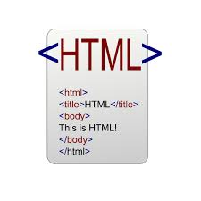

<h1 align="center">
  𝐇𝐞𝐥𝐥𝐨, &lt;Testers/&gt;!
  
</h1>

 
 

- 👋 Hi, I’m Sargam, QA by Profession having an experience of 4+ years in testing.
- 💼 Expertise in creating test plans, executing test cases using Azure Devops Platform.
- 📈 Worked on 30+ live projects, and performed both UI and functional testing on them. 
- 🌱 I’m currently learning and working with Selenium using Java.
- 👯 I’m looking to collaborate on the depth of automation testing.
- 👀 I’m interested in learning new things about testing, photography, and painting.
- 📫 How to reach me:
     [LinkedIn](https://www.linkedin.com/in/sargampanwar/)
 

# <h2>&#x1F469; Women_in_Test </h2>

  
<h2>
  🌐 Language and Tools:
</h2>

<code style="display: flex; justify-content: center; align-items: center;"></code>
<code style="display: flex; justify-content: center; align-items: center;" ></code>
<code style="display: flex; justify-content: center; align-items: center;"></code>
<code style="display: flex; justify-content: center; align-items: center;"></code>

 

<code style="display: flex; justify-content: center; align-items: center;"></code>
<code style="display: flex; justify-content: center; align-items: center;"></code>
<code style="display: flex; justify-content: center; align-items: center;"></code>
<code style="display: flex; justify-content: center; align-items: center;"></code>
<code style="display: flex; justify-content: center; align-items: center;"></code>
<code style="display: flex; justify-content: center; align-items: center;"></code>

 

<h2>&#x1F516; Extensions Recommended </h2>
<h3> Video Recording: </h3>
 JAM : An open-source JavaScript framework for media applications that supports real-time video capture, along with network and console logging capabilities.  

 
 BirdsEatBugs : A premium, lightweight library for video processing (e.g., stabilization and noise reduction) that includes automated test scripts, supporting multiple languages and tools.  
 Vidyard : A professional video hosting and analytics platform for uploading, managing, and analyzing videos, including those with voice recordings.

 <h3>Automated Test Case Generator:</h3>
 TestCraft : It is a no-code test automation tool that enables users to create, execute, and maintain automated tests for web applications without writing code.

 <h3>Responsive View:</h3>
 Mobile Simulator : The Mobile Simulator extension allows you to simulate and test mobile device interactions directly within your browser for responsive web design and functionality.
 

<!---
Sargamp16/Sargamp16 is a ✨ special ✨ repository because its `README.md` (this file) appears on your GitHub profile.
You can click the Preview link to take a look at your changes.
--->
